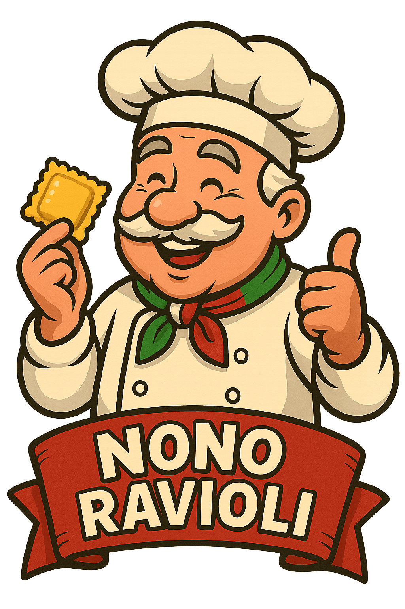

<h1 align="center">TPI Programación 2</h1>

  

**Nono Ravioli** es una tradicional fábrica de pastas artesanales fundada con el sabor y la calidez de la cocina italiana. Desde hace generaciones, nos dedicamos a elaborar ravioles, ñoquis, tallarines y muchas otras delicias con ingredientes frescos y recetas que honran el legado de nuestro fundador: El Nono. Nos apasiona compartir el auténtico sabor casero en cada plato, llevando la tradición a tu mesa con calidad y dedicación.

## Integrantes

- Ignacio Jesus Frisco  
- Stefano Bellagamba  
- Ernesto Ramón Londero  
- Gregorio Hilman  
- Jonathan Gabriel Gago
